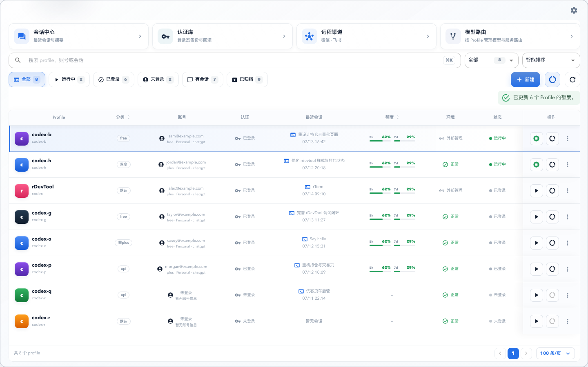
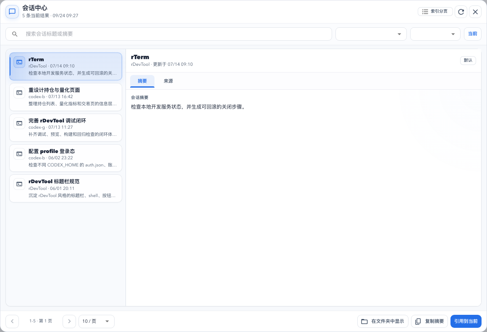
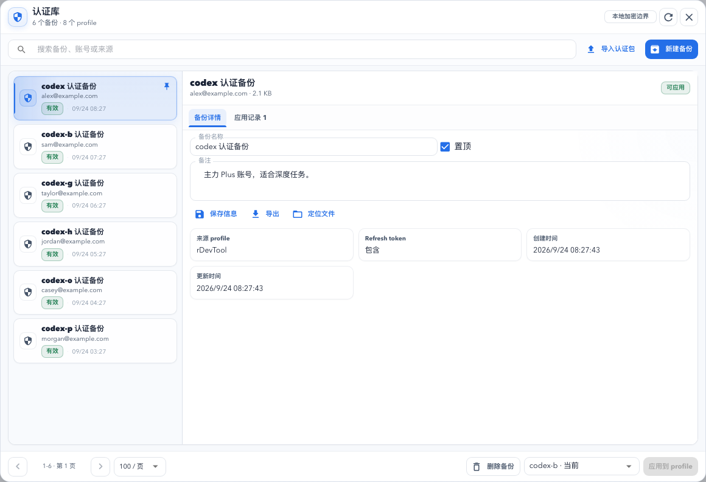
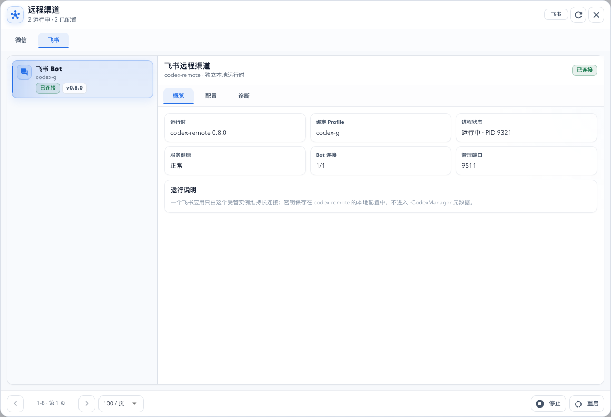
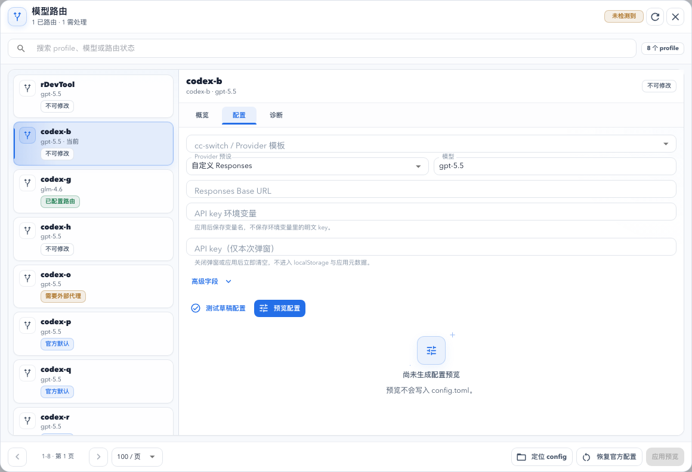

# rCodexManager

<p align="center">
  中文 · <a href="README_EN.md">English</a>
</p>

<p align="center">
  <a href="https://rcm.rurie.top">官方网站</a> ·
  <a href="https://rcm.rurie.top/zh/docs">使用文档</a> ·
  <a href="https://github.com/r-series-lab/rcodexmanager/releases">预览版下载</a> ·
  <a href="https://github.com/r-series-lab/rcodexmanager/issues">问题反馈</a>
</p>

> **独立项目声明：** rCodexManager 是社区维护的独立开源项目，不隶属于 OpenAI，也未获得 OpenAI 的赞助或背书。Codex 与 OpenAI 是其各自权利人的商标。当前 `0.1.x` 为 Public Preview，安装包签名状态见[发布流程](docs/RELEASE_WORKFLOW.md)。

`rCodexManager` 是一个本地优先的 Codex 多 profile 工作台。它把多个隔离的 Codex 实例、历史会话、登录态备份、远程消息渠道和第三方模型路由集中在一个桌面应用与 CLI 中管理。

它适合这些场景：

- 为日常开发、深度研究、插件测试或服务器任务准备互不干扰的 Codex profile。
- 快速确认每个 profile 的运行、登录、模型和最近会话状态。
- 在停止中的 profile 之间安全备份、应用和回滚登录态。
- 通过微信或飞书 Bot 远程连接指定 profile。
- 为阿里 Qwen、GLM、本地模型或自定义 Responses 服务生成和维护 Codex 路由配置。

技术栈：`Tauri 2 + Rust + React 19 + TypeScript + Material UI`

## 产品能力

| 模块 | 主要能力 | 数据加载策略 |
| --- | --- | --- |
| Profile 工作区 | 创建、复制、编辑、启动、终止、重置、归档、官方登录、账号导入、额度窗口查询 | 首页只读取 profile 状态和最近摘要 |
| Doctor 诊断 | 一键检查启动配置、profile 路径、进程、认证、模型路由、代理、认证库与远程渠道 | 只读执行，报告自动脱敏 |
| 会话中心 | 搜索、profile/分类筛选、`10/50/100` 分页、摘要/来源详情、复制摘要 | 先读索引，选中后才读取单条 JSONL 详情 |
| 认证库 | 单个或批量备份、导入预检、导入导出、备注/置顶、应用、回滚、重复清理 | 打开弹窗后加载，30 秒缓存 |
| 远程渠道 | 微信扫码、启停、重启、可恢复解绑；飞书外部运行时绑定、启停和日志 | 仅在等待连接或运行时轮询 |
| 模型路由 | 状态检查、模板、草稿测试、配置预览、应用、恢复、自检、代理诊断 | 打开弹窗后加载，敏感字段只保存在内存 |

桌面窗口默认与最小尺寸均为 `1000×800`。各管理域共用紧凑的主从式弹窗、亮色/暗色/跟随系统主题和统一的加载、错误、空状态与安全确认交互。

设置弹窗中的“运行诊断”可生成一份只读 Doctor 报告。诊断不会修改 profile、认证或渠道配置；报告只保留状态和可操作建议，并隐藏 token、密钥、邮箱与完整本机路径。出现问题时建议先运行诊断，再进入对应管理中心处理。

## 界面预览

公开界面图由仓库内置 mock 数据生成，只包含 `example.com` 账号和示例路径。主工作区用于快速比较，较重的任务进入四个按需加载的管理中心。



| 会话中心 | 认证库 |
| --- | --- |
|  |  |

| 远程渠道 | 模型路由 |
| --- | --- |
|  |  |

完整交互、数据加载和安全边界见[界面与功能说明](docs/interface.md)。

## Profile 模型

rCodexManager 读取并维护以下本地资源：

- 默认 profile：`~/.codex` 与 Codex 默认 user data。
- 自定义 profile：自动检测的 `~/.zshrc` 或 `~/.bashrc` 中的 `codex-*` 启动函数。
- 每个 profile 独立的 `CODEX_HOME`。
- 每个桌面 profile 独立的 `--user-data-dir`。
- rCodexManager 自有的别名、分类和备注。

创建 profile 时会生成目录、`config.toml` 和启动函数。桌面 profile 使用 macOS `open -n -a "Codex"`；`--server` profile 使用适合 Linux/服务器的 `CODEX_HOME=... codex "$@"` 启动函数。

默认 `codex` profile 受到保护，不能删除、重置、覆盖认证或应用模型路由。运行中的 profile 不能执行认证写入或模型路由写入。

## 主要管理域

### Profile 列表与详情

- 从默认目录和 Bash/Zsh 启动配置自动发现 profile。
- 支持关键词、运行/登录/会话状态与分类筛选。
- 展示账号、模型、路径、最近会话、额度、环境和进程状态。
- 账号区可直接启动官方 Codex 登录，并展示可复制的浏览器 OAuth 地址。
- 按需读取 5 小时、周额度及其他 usage 窗口；展示已用比例、重置时间和可执行的过期/网络错误提示，不持久化 access token。
- 自定义模型可通过 `~/.rcodexmanager/quota-providers.toml` 扩展额度查询；未配置扩展时显示“暂不支持”，不会 fallback 到官方额度接口。
- 行点击只选择 profile，不打开额外侧栏；双击可直接编辑别名、分类、备注、模型和推理等级。
- 列表操作栏直接提供启动/停止、额度查看和更多操作；已归档 Profile 显示恢复与删除。认证、编辑、归档和删除等低频操作收纳在 `...` 菜单。
- 停止中的自定义 profile 可软归档：归档后从“全部”隐藏，但启动配置、目录、认证、会话和模型配置保持不变，可随时从“已归档”恢复。
- 操作列固定在列表右侧，横向滚动时保持对齐。

#### 自定义额度查询

额度扩展配置文件为 `~/.rcodexmanager/quota-providers.toml`。Profile 通过 `[profiles.<profile>]` 下的 `provider` 关联 Provider；API Key 只配置环境变量名，不把密钥写入文件：

```toml
[profiles.codex-kimi]
provider = "kimi"

[providers.kimi]
url = "https://api.example.com/quota"
auth = "api-key"
api_key_env = "KIMI_API_KEY"

[providers.kimi.mapping]
windows = "data.windows"
id = "id"
label = "name"
remaining_percent = "remaining_percent"
used_percent = "used_percent"
window_minutes = "window_minutes"
resets_at = "reset_at"
status = "status"
```

未配置 Profile Provider 的自定义 Profile 显示“暂不支持”；额度排序不会把不可查询项当作 `0%`。

### 会话中心

- 读取 `<CODEX_HOME>/session_index.jsonl` 建立分页列表。
- 默认每页 10 条，可切换 `10/50/100`；CLI 的 `sessions list --limit` 同样支持 1–100。
- 搜索时采用有界扫描，不在打开弹窗时读取全部会话正文。
- 选中一条会话后才读取对应 `sessions/**/*.jsonl`。
- 详情按 `profile + session id + updatedAt` 缓存，并忽略过期响应。

### 认证库

- 从一个或多个 profile 创建认证备份，批量任务返回逐项结果。
- 导入 `.rcodex-auth.json` 前先执行只读预检。
- 识别有效、损坏和文件缺失的备份；无效备份不能应用。
- 应用前备份目标 `auth.json`，并记录可回滚的应用历史。
- 支持标签、备注、置顶、导入、导出、删除和同账号重复清理。

认证库用于管理用户明确授权的本地登录态，不绕过 Codex 登录机制，也不会把 token 发送到 rCodexManager 自有服务。

### 远程渠道

微信渠道按 profile 管理独立 `wechat-acp` 实例，当前固定使用 `wechat-acp@0.10.0` 与 `@agentclientprotocol/codex-acp@1.12.0`：

- 支持扫码启动、停止、重启、日志和 profile 切换。
- 解绑会先停止实例，再把 token 移入时间戳备份目录。
- 服务器 profile 可生成或安装用户级 systemd service。

飞书渠道复用用户自行安装的 [`codex-remote-feishu`](https://github.com/kxn/codex-remote-feishu)：

- rCodexManager 不捆绑、不静默下载该外部运行时。
- 使用独立实例 `rcodexmanager`，数据位于 `~/.rcodexmanager/feishu-remote/`。
- 一次绑定一个 Codex profile，支持配置、启动、停止、重启和脱敏日志。
- App ID 与 App Secret 只在外部运行时的 WebSetup 中保存，rCodexManager 不读取这些凭据。

### 模型路由

模型路由管理目标 profile 的 `config.toml`，支持：

- `aliyun-qwen`：阿里百炼/Qwen Responses-compatible 直连。
- `glm`：智谱/Z.ai Chat-compatible 上游，通常需要 Responses 转换代理。
- `local-openai`：本地 OpenAI-compatible Chat 上游。
- `custom-responses`：自定义 Responses-compatible 服务。

桌面端提供基础内置代理，也可以打开 cc-switch 使用更成熟的 provider 适配。cc-switch 是推荐增强，不是 rCodexManager 的硬依赖。

应用模型路由前必须先预览；写入前会备份 `config.toml`，且永远不修改 `auth.json`。弹窗中的明文 key 不会进入 localStorage 或应用元数据；环境变量方式会在配置中保存 `env_key` 变量名，明文方式应用后会写入 Profile 的 `config.toml`。CLI 只接受环境变量名，不接受明文 key 参数。

内置转换代理支持把 Chat Completions 上游转换为 Codex 使用的 Responses 接口，并处理流式文本、工具调用、结束状态和 usage 摘要。它适合本地验证和基础 provider 兼容；复杂路由、供应商管理和长期运行仍建议交给 cc-switch 或独立网关。

## 快速开始

```bash
npm install
npm run dev
```

构建桌面应用：

```bash
npm run build
```

将当前源码对应的 CLI 安装到已在 `PATH` 中的 `~/.local/bin`：

```bash
npm run cli:install
rcodexmanager --json info
rcodexmanager --json capabilities
```

安装脚本会使用当前主机 release 二进制并回显实际版本与产品架构。也可以把已构建二进制路径作为脚本参数传入。

`npm run build` 只用于本地开发验证，不作为正式 Release 资产来源。日常源码验收使用：

```bash
npm run check
```

测试无界面节点，并在 Linux 或发布工作流中构建归档：

```bash
npm run headless:test
npm run headless:package
```

将 `dist/rCodexManager_<version>_linux-<arch>.tar.gz` 上传到服务器并解压后：

```bash
./install.sh
~/.local/bin/rcodexmanager --json doctor
```

服务器需要已有 Codex CLI；启停 Profile 还需要 `tmux`。rCodexManager 不会自动修改服务器、防火墙或运行时配置。

## 发布流程

rCodexManager 不从开发 Mac 上传桌面安装包或 Linux Headless 归档。批准的周末发布窗口内，由发布服务器生成过滤后的干净源码记录并推送与版本一致的 `vX.Y.Z` Tag；GitHub Actions 从该 Tag 构建 macOS、Windows 与 Linux Headless 候选产物，并创建带 SHA-256 清单的 Draft prerelease。

当前 `0.1.x` 桌面包仍未完成 macOS Developer ID 签名与公证、Windows Authenticode 签名和 updater 闭环，因此不会作为官网正式下载。详见[发布流程](docs/RELEASE_WORKFLOW.md)，版本变化见[更新日志](CHANGELOG.md)。

### Codex Skill

仓库内的 `skills/rcodexmanager` 是 Skill 标准源文件，支持 Mac 本地、Mac 管理 Linux 以及 Linux 无界面 CLI。安装到默认 Codex：

```bash
npm run skill:install
npm run skill:check
```

安装到隔离 Profile 的 `CODEX_HOME`：

```bash
npm run skill:install -- --home "$HOME/.codex-g"
```

更新 Skill 时先修改仓库版本，再执行安装脚本；不要直接维护 `~/.codex/skills/rcodexmanager` 副本。

只验证前端和 Rust：

```bash
npm run web:build
npm run rust-check
npm run rust-test
```

## CLI

CLI 与桌面端共享同一套 Rust 核心逻辑。自动化调用建议始终使用 `--json`。

开发期从源码运行：

```bash
cargo run --quiet --manifest-path ./src-tauri/Cargo.toml -- --json info
cargo run --quiet --manifest-path ./src-tauri/Cargo.toml -- --json list
```

安装后二进制调用：

```bash
rcodexmanager --json info
rcodexmanager --json capabilities
rcodexmanager --json list
rcodexmanager --json archive --name codex-g
rcodexmanager --json restore --name codex-g
rcodexmanager --json quota --name codex-g
```

常用示例：

```bash
# 一键只读诊断；错误项存在时退出码为 1
rcodexmanager --json doctor

# 分页读取会话索引，再按需读取详情
rcodexmanager --json sessions list --profile codex-g --limit 20
rcodexmanager --json sessions detail --profile codex-g --session-id <id>

# 批量备份认证并只读预检导入包
rcodexmanager --json auth backup-many --name codex-b --name codex-g --label Snapshot
rcodexmanager --json auth preview-import --file ./backup.rcodex-auth.json

# 官方 Codex 登录是交互式流，不使用 --json
rcodexmanager login --name codex-g
rcodexmanager login --name codex-g --device-auth

# 查看远程渠道
rcodexmanager --json wechat status
rcodexmanager --json feishu status

# 自定义模型额度：读取 ~/.rcodexmanager/quota-providers.toml
rcodexmanager --json quota --name codex-kimi

# 预览并测试模型路由草稿
rcodexmanager --json model-route preview --name codex-g --preset glm --model glm-4.6 \
  --proxy-base-url http://127.0.0.1:15721/v1 \
  --upstream-base-url https://open.bigmodel.cn/api/paas/v4
rcodexmanager --json model-route test-draft --name codex-g --preset glm --model glm-4.6 \
  --upstream-base-url https://open.bigmodel.cn/api/paas/v4 \
  --api-key-env ZAI_API_KEY
```

完整参数、JSON 合同和安全说明见 [CLI 文档](docs/cli.md)。

## JSON 合同

成功：

```json
{
  "ok": true,
  "command": "list",
  "data": {}
}
```

失败：

```json
{
  "ok": false,
  "error": {
    "code": "invalid_arguments",
    "message": "..."
  }
}
```

常见退出码：`0` 成功，`1` 操作失败，`2` 参数或确认缺失，`3` 资源不存在。

## 数据与安全

| 数据 | 默认位置 |
| --- | --- |
| 启动函数 | 自动检测的 `~/.zshrc` 或 `~/.bashrc` |
| profile 元数据 | `~/.rcodexmanager/profile-metadata.json` |
| 默认 Codex profile | `~/.codex` |
| 自定义 CODEX_HOME | `~/.codex-<suffix>` |
| 自定义桌面 user data | `~/Library/Application Support/Codex-<TitleSuffix>` |
| Codex 配置/登录态 | `<CODEX_HOME>/config.toml`、`<CODEX_HOME>/auth.json` |
| 会话索引/正文 | `<CODEX_HOME>/session_index.jsonl`、`<CODEX_HOME>/sessions/**/*.jsonl` |
| 认证库 | `~/.rcodexmanager/auth-vault.json`、`auth-vault/*.auth.json` |
| 自定义额度查询 | `~/.rcodexmanager/quota-providers.toml` |
| 微信桥接 | `~/.rcodexmanager/wechat-bridges.json`、`wechat-bridges/` |
| 飞书绑定/运行时 | `~/.rcodexmanager/feishu-remote.json`、`feishu-remote/` |

安全策略：

- Shell 启动配置、`config.toml` 和目标 `auth.json` 在关键写入前备份。
- 删除 profile 默认只删除启动函数；`--archive-data` 也只是归档目录。
- 微信解绑归档 token，不直接永久删除。
- 认证应用、回滚、导入、导出、删除和清理要求明确的敏感操作确认。
- 模型路由不写 `auth.json`，日志不记录请求正文、token 或 API key。
- rCodexManager 不会停止无法确认归属的外部代理进程。
- 单次 CLI stdout 上限为 `8 MiB`，超限会明确失败并要求缩小请求；不会静默返回不完整 JSON。

## 开发命令

```bash
npm run dev          # Tauri 桌面开发版
npm run check        # 统一源码验收，不生成 Release 资产
npm run web:dev      # 仅启动 Vite 前端
npm run web:build    # TypeScript + Vite 构建
npm run web:test     # Vitest + React Testing Library
npm run web:test:e2e # Playwright 多尺寸、多主题验证
npm run rust-check   # Rust 类型检查
npm run rust-test    # Rust 单测与 CLI contract
npm run headless:test  # Linux 无界面 CLI 测试
npm run headless:package # Linux 无界面节点归档
npm run build        # 桌面安装包
```

## 项目结构

```text
src/                         React 前端、主题、API 和类型
src/features/                会话、认证、远程渠道和模型路由弹窗
src/components/manager/      管理弹窗公共外壳与交互组件
src-tauri/src/core.rs        桌面与 CLI 共用的业务核心
src-tauri/src/cli.rs         CLI 参数、帮助和 JSON 输出
src-tauri/tests/             Rust 集成与 CLI contract 测试
headless-cli/                不依赖 Tauri/桌面的 Linux CLI crate
skills/rcodexmanager/         可安装到 Mac/Linux CODEX_HOME 的标准 Skill
docs/cli.md                  完整 CLI 参考
```

## 边界

- 不管理 Codex 订阅、组织或云端权限。
- 不解析所有 shell 语法，只支持项目约定的 `name() { ... }` 启动函数。
- 不默认删除历史会话数据。
- 不内置完整 provider 商店、余额服务或持久化密钥库。
- 不接管用户已有的 codex-remote 默认实例或 cc-switch 进程。
- 不把 Mac 桌面界面搬到 Linux；Linux 只运行无界面 CLI 和用户明确启动的渠道/终端进程。
- 不提供远程终端画面；需要交互式使用时可在服务器执行 `tmux attach -t rcodexmanager-<profile>`。

## License

MIT
