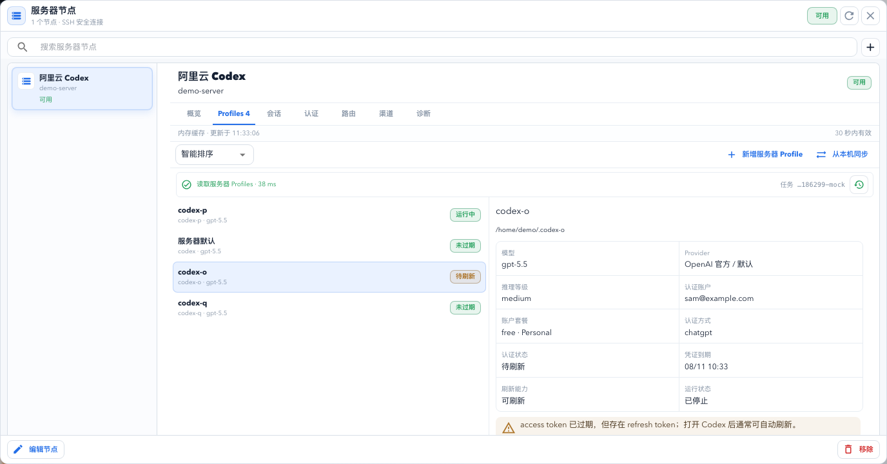

# Interface and Feature Guide

rCodexManager treats a Profile as the primary object. The main workspace is optimized for status comparison, while sessions, authentication, channels, routing, and Linux operations live in five lazy-loaded management centers. Public screenshots are generated from browser mock data and contain only `example.com` identities and sample paths.

## Main Workspace

The compact table presents Profile identity, category, account and plan, authentication health, latest session, on-demand quota, environment health, runtime state, and lifecycle actions. Clicking a row selects it without opening the detail view. Double-click opens the full editor. The context menu is intentionally limited to start/stop, edit, archive, and delete.

Archiving hides a stopped custom Profile from active results without changing its launcher, authentication, configuration, sessions, or data directories. The archived filter provides the recovery path. Search, category, smart/recent sorting, runtime/auth/session filters, and current-page quota queries keep the daily list bounded.

Daily flow:

1. Find the target Profile with search, category, and state filters.
2. Check authentication, model, latest session, quota, and runtime state before taking action.
3. Use row buttons for frequent lifecycle work and the overflow menu for sessions, authentication, paths, quota, and sign-in.
4. Keep the protected default Profile mostly read-only; create a custom Profile before experimenting with authentication or model changes.

## Five Management Centers

All five centers share the same header, toolbar, master-detail layout, status badges, loading and error states, and fixed action bar. They use about 80 percent of the available app height and switch to a single-panel list/detail flow in narrower windows.

### Session Center

The session center reads a bounded index page first. Search, Profile, category, and `10/20/50` page-size controls refine the index. Selecting an entry is the only action that loads its JSONL summary and source detail, and stale requests cannot replace newer filters.

Usage notes:

- Filter by Profile, category, or query before increasing the page size.
- Select a row only when you need one transcript detail; the list itself stays at index and summary level.
- When sharing context with an agent or teammate, prefer title, time, cwd, summary, and source path over the full JSONL body.

### Authentication Vault

The vault manages authorized `auth.json` backups and marks them valid, damaged, or missing. Details expose metadata, import preview, export, apply, rollback, and duplicate cleanup. The protected default Profile, a running Profile, or an invalid backup cannot become a write target.

Usage notes:

- Back up from a known Profile state, preferably when the Profile is stopped.
- Preview every imported package before applying it to a stopped custom Profile.
- Confirm target, account, source, and rollback evidence before applying; do not overwrite the protected default Profile.

### Remote Channels

WeChat state is tracked per Profile as unbound, waiting for QR, bound and stopped, running, or failed. The app supports lifecycle controls, redacted logs, and recoverable unbinding. Feishu uses an explicitly installed `codex-remote-feishu` runtime; rCodexManager stores the Profile/runtime binding but never the Feishu App ID or App Secret.

Usage notes:

- WeChat instances are per Profile; scan, start, stop, restart, and unbind affect only the selected Profile.
- Configure Feishu in the external runtime first, then bind the Profile and binary path in rCodexManager.
- Logs are redacted by default; for connection failures, refresh state and read the latest logs before restarting.

### Model Routing

Overview, configuration, and diagnostics keep saved state separate from the draft form. Draft tests do not write files, and every apply requires a fresh preview. Applying or restoring a route backs up `config.toml` and never modifies `auth.json`. The desktop proxy provides basic conversion, while cc-switch can remain the external provider gateway.

Usage notes:

- Start with a stopped custom Profile, then choose the provider template, model, and base URLs.
- Test new providers as drafts first; remote nodes accept only an API-key environment variable name.
- Preview the exact configuration before applying it, then review the self-check result.
- Restoring official configuration removes route fields while keeping authentication and sessions intact.

### Linux Server Nodes

The Mac app selects an SSH Host from `~/.ssh/config` and calls the remote headless CLI through a single-object JSON contract. Profiles, sessions, authentication, routing, channels, and Doctor load only when their tab is opened. rCodexManager does not store SSH credentials, and optional authentication transfer travels through SSH stdin.

Usage notes:

- Add a node from an existing SSH Host and set the absolute path to the remote `rcodexmanager` CLI.
- Run Doctor and load Profiles before moving into sessions, authentication, routing, or channels.
- After a failed remote write, refresh state first; do not blindly repeat create, launch, authentication apply, or route apply.
- Local-to-server sync is for creating a new server Profile. Authentication transfer has a separate confirmation and does not copy sessions or desktop user data.

## Create, Edit, and Sign In

The create task collects command name, display name, category, model, reasoning effort, and paths with a live preview. Users can create only or create and continue into official sign-in. The editor groups metadata, model settings, and runtime paths; model writes require a stopped custom Profile and create a configuration backup first.

Local sign-in uses the official Codex browser OAuth flow. A Linux node uses device authentication. The authorization URL and one-time code remain in process memory and are cleared after success, cancellation, or expiry.

## Settings and Diagnostics

Settings controls light, dark, system theme, Chinese, and English. Doctor is a read-only, redacted check of launch configuration, paths, processes, authentication, routing, proxies, and channels.

## Loading Boundaries

- The main workspace does not preload full transcripts, vault contents, channel logs, or model-route reports.
- Opening a center loads that domain; a 30-second in-memory cache can render immediately while refreshing.
- Transcript bodies, logs, and quota are read only after selection or explicit action.
- API keys live only in the active model-route dialog and are cleared on close or apply.
